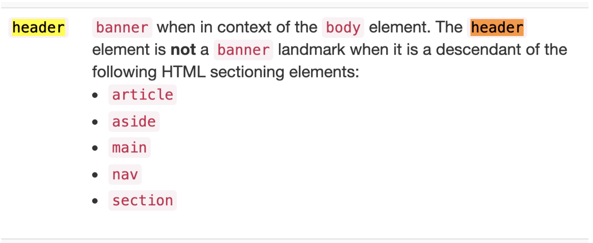

# 스타벅스 - 웹 표준(Web standards)과 웹 접근성(Web accessibility) 개선 프로젝트

    

본 프로젝트는 현재 서비스중인 스타벅스 웹 페이지를 단순 clone하는 것이 아닌 웹 표준(Web standards)과 웹 접근성(Web accessibility)에 기반하여 현재 페이지에서의 개선점을 분석하고 분석한 개선사항을 적용하여 기존의 페이지를 재구성하는 프로젝트입니다.

**Top 10 Web Accessibility Standards Every Developer Should Know**
→ [https://dev.to/mlimonczenko/top-10-web-accessibility-standards-every-developer-should-know-5cih](https://dev.to/mlimonczenko/top-10-web-accessibility-standards-every-developer-should-know-5cih)

## HTML Markup을 할때

    - Contents의 논리흐름을 고려해서 HTML 태그를 마크업해야 한다.

## 웹 표준 및 접근성에 기반한 취약점 분석 및 개선안

개선안 1) 현재 페이지의 header 부분이 native HTML5 element인 header 태그를 사용하지 않고 div태그로 작성을 하였다. 이런 경우에는 native HTML5 element인 header를 사용하거나 기존의 div 태그 내에 ARIA Landmark role로 banner 속성값을 지정해주는 것이 좋다.

[https://www.w3.org/TR/wai-aria-practices/examples/landmarks/HTML5.html](https://www.w3.org/TR/wai-aria-practices/examples/landmarks/HTML5.html)

    

